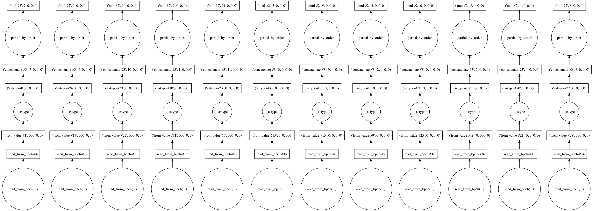
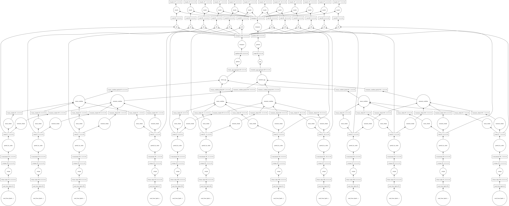
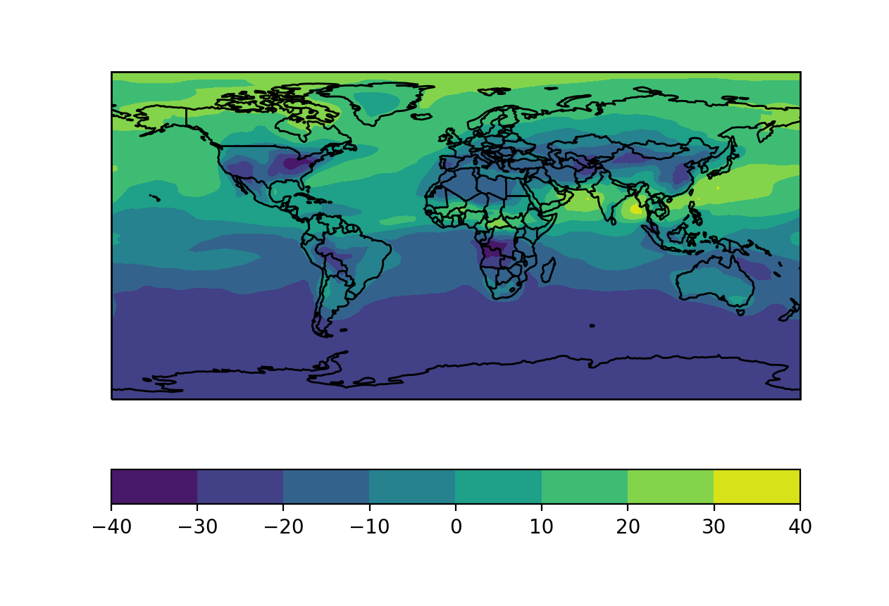
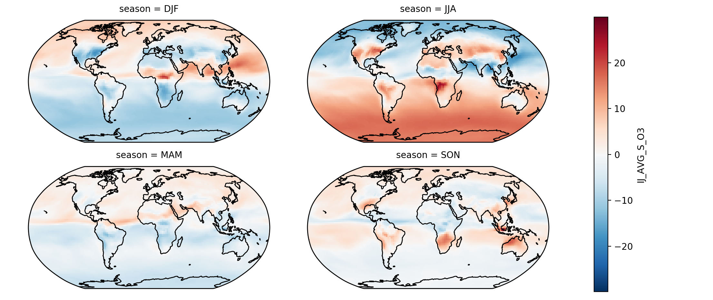

Usage and Examples
==================

Reading Output
--------------

The routines for reading bpch files from disk into ``xarray.Dataset``\s is
based mostly on the ``xarray.open_dataset`` method. However, to handle
some of the idiosyncrasies of GEOS-Chem output, our implementation of
:py:func:`~xbpch.open_bpchdataset` has a few additional arguments to know
about.

Main :py:func:`~xbpch.open_bpchdataset` Arguments
^^^^^^^^^^^^^^^^^^^^^^^^^^^^^^^^^^^^^^^^^^^^^^^^^

The majority of the time, you'll want to load/read data via xarray, using the
method :py:func:`~xbpch.open_bpchdataset`, as shown in the :ref:`quick start`.
This routine fundamentally requires three arguments:

- ``filename``: the full path to the output file you want to load
- ``tracerinfo_file``: the full path to the file *tracerinfo.dat*, which
  contains the names and indices of each tracer output by GEOS-Chem
- ``diaginfo_file``: the full path to the file *diaginfo.dat*, which contains
  the listing of categories and their tracer number offsets in the tracer
  output index.

If you don't pass a value for either ``tracerinfo_file`` or ``diaginfo_file``,
**xbpch** will look for them in the current directory, assuming the Default
naming scheme. However, if it *still* can't find a file, it'll raise an error
(we do not assume to know what is in your output!)

In many simulations, GEOS-Chem will write multiple timesteps of a large number
of fields to a single output file. This can result in outputs on the order of
10's of GB! If you know for certain that you only want a specific tracer or
category of tracers, you can supply a list of their names to either ``fields``
or ``categories``.

For instance, using the `v11-01 diagnostics <http://wiki.seas.harvard.edu/geos-chem/index.php/List_of_diagnostics_for_v11-01>`_
for reference, we can load in any tracer with the name "O3" by passing

.. ipython:: python
    :verbatim:

    import xbpch
    o3_data = xbpch.open_bpchdataset("my_data.bpch", fields=['O3', ])

Alternatively, we can load all the tracers associated with a given category
by specifying the ``categories`` argument. To grab all the saved 2D meteorology
fields, this would entail

.. ipython:: python
    :verbatim:

    met_data = xbpch.open_bpchdataset(
        "my_data.bpch", categories=["DAO-FLDS", ]
    )


What Works and Doesn't Work
^^^^^^^^^^^^^^^^^^^^^^^^^^^

**xbpch** should work with most standard GEOS-Chem outputs going back to at
least v9-02. It has been tested against some of these standard outputs, but
not exhaustively. If you have an idiosyncratic GEOS-Chem output (e.g. from a
specialized version of the model with custom tracers or a new grid), please
give **xbpch** a try and if it fails, post a `an Issue on our GitHub page <https://github.com/darothen/xbpch/issues>`_
to let us know.

The following configurations have been tested and vetted:

- Standard output on standard grids
- ND49 output on standard grids
- ND49 output on nested North America grid (should work for all nested grids)


Eager vs Lazy Loading
^^^^^^^^^^^^^^^^^^^^^

One of the main advantages to using **xbpch** is that it allows you to access
data without immediately need to read it all from disk. On a modern
analysis cluster, this isn't a problem, but if you want to process output
on your laptop, you can quickly run into situations where all of your data
won't fit in memory. In those situations, you have to tediously block your
analysis algorithms/pipeline.

.. note::

    Even though you may request lazily-loaded data, **xpbch** still needs
    to read your input file to parse its contents. This requires iterating
    line-by-line through the input file, so it may take some time (about
    ~10 seconds to read a 6GB file on my late-2016 MacBook Pro).
    Unfortunately, if we don't do this, we can't infer the tracers or their
    distribution over multiple timesteps containined in the input file.

The keyword arguments ``memmap`` and ``dask`` control how data is read from
your bpch files.

``memmap``
  if enabled, the data for each timestep and variable will be
  accessed through a memory-map into the input file
``dask``
  if enabled, the function to read each timestep for each variable
  will be wrapped in a ``dask.delayed`` object, initiating a task graph
  for accessing the data

.. warning::

    Opening a dataset using ``memmap=True`` and ``dask=False`` *will not work*.
    Each memory-mapped array counts as an open file, which will quickly add up
    and hit your operating system's limit on simultaneously open files.

If ``dask=True`` is used to open a dataset, then all of the data in the bpch
file is represented by  ``dask.array``\s, and all operations are lazy. That is,
they are not evaluated until the user explicitly instruct them to be, and
instead a graph representing your computation is constructed.


Chunking
^^^^^^^^

When data is loaded with the ``dask`` flag enabled, all the operations
necessary to create contiguous chunks of data are deferred. Because of the way
data is written to bpch files by GEOS-Chem, these deferred actions are all
based on single timesteps of data for each variable by default. Thus, in the
parlance of dask, all the data is implicitly chunked on the **time** dimension.

When dask encounters chunked calculations, it will automatically attempt
to parallelize them across all the cores available on your machine, and will
attempt to limit the amount of data held in-memory at any give time.

To illustrate this, consider a monthly history dataset ``ds`` loaded via
:py:func:`~xbpch.open_bpchdataset`. The inital task graph representing this
data may look something like:



    Tasks for reading and processing monthly output for a single variable in
    a year-long bpch output file

This graph illustrates that dask is expected to process 12 chunks of data - one
for each month (timestep) in the dataset. The graph shows the operations for
reading the data, casting it to the correct data type, and re-scaling, which are
applied automatically by **xbpch** and xarray.

At this point, the data has only been processed in such a way that it fits
the numpy.ndarray memory model, and thus can be used to construct xarray
objects. A trivial calculation on this data may be to normalize the timeseries
of data in each grid cell to have zero mean and unit variance. For any
``xarray.DataArray`` we could write this operation as

.. ipython:: python
    :verbatim:

    da_normal = (da - da.mean('time'))/da.std('time')

which produces the computational graph



    Computational graph for normalizing monthly data

A second key function of ``dask`` is to analyze and parse these computational
graphs into a simplified form. In practice, the resulting graph will be
much simpler, which can dramatically speed up your analysis. For instance, if
you sub-sample the variables and timesteps used in your analysis, **xbpch**
(through dask) will avoid reading extra, unused data from the input files you passed
it.

.. note::

    Sometimes it's advantagous to re-chunk a dataset (see
    `here <http://xarray.pydata.org/en/stable/dask.html>`_ for a discussion on
    when this may be the case). This is easily accomplished through xarray, or
    can be done directly on the ``dask.array``\s containing your data if you
    have a more complex analysis to perform.


Finally, it's important to know that the computational graphs that dask
produces are never evaluated until you explicitly call ``.load()`` on a dask
array or xarray Data{Array,set}. Different computations or uses for your data
might imply an automatic ``load()``; for instance, if you use the plotting
wrapper built into xarray, it will (necessarily) eagerly load your data. If you'd
like to monitor the progress of a very long analysis built through
**xbpch**/xarray/dask, you can use the built-in diagnostic tools from dask:

.. ipython:: python
    :verbatim:

    from dask.diagnostics import ProgressBar

    # Construct some analysis
    my_ds = ...

    # Eagerly compute the results
    with ProgressBar() as pb:
        my_ds.load()

.. parsed-literal::
   [####################################] | 100% Completed | 10.2s

Geographic Visualization
------------------------

One easy application of **xbpch** is for the visualization of your data.
For cartographic or geographic plots, we recommend using the cartopy_ package
maintained by the UK Met Office.

Plotting on a cartopy_ map is straightforward. Suppose we have a Dataset ``ds``
read from a bpch file. We can first compute an analysis of interest - say,
the difference between mean fields for summer versus winter:

.. ipython:: python
    :verbatim:

    ds_seas = ds.groupby("time.season").mean('time')
    diff = ds_seas.sel(season='DJF') - ds_seas.sel(season='JJA')

.. parsed-literal::

    <xarray.Dataset>
    Dimensions:      (lat: 91, lev: 47, lon: 144, nv: 2)
    Coordinates:
      * lev          (lev) float64 0.9925 0.9775 0.9624 0.9473 0.9322 0.9171 ...
      * lon          (lon) float64 -180.0 -177.5 -175.0 -172.5 -170.0 -167.5 ...
      * lat          (lat) float64 -89.5 -88.0 -86.0 -84.0 -82.0 -80.0 -78.0 ...
      * nv           (nv) int64 0 1
    Data variables:
        ANTHSRCE_O3  (lon, lat) float32 0.0 0.0 0.0 0.0 0.0 0.0 0.0 0.0 0.0 0.0 ...
        IJ_AVG_S_O3  (lon, lat, lev) float32 -23.1014 -23.2715 -23.4614 -23.5216 ...

Plotting a portion of this dataset on a cartopy_ map is straightforward. First,
we create a figure and add an axes with the map projection information
encoded:

.. ipython:: python
    :verbatim:

    import matplotlib.pyplot as plt
    import cartopy.crs as ccrs

    fig = plt.figure()
    ax = fig.add_subplot(111, projection=ccrs.PlateCarree(), aspect='auto')

Then, we can plot our data as normal. cartopy_ has a few helper functions which
we can use to add basic geographic elements such as coastlines and borders to
the plot.

.. ipython:: python
    :verbatim:

    import cartopy.feature as cfeature

    # Select some data to plot
    da = diff.isel(lev=0).IJ_AVG_S_O3

    im = ax.contourf(da.lon.values, da.lat.values, da.values.T)
    cb = fig.colorbar(im, ax=ax, orientation='horizontal')
    ax.add_feature(cfeature.COASTLINE)
    ax.add_feature(cfeature.BORDERS)



    Example of a simple plot with cartopy_

Alternatively, we can use `xarray's matplotlib wrappers <http://xarray.pydata.org/en/stable/plotting.html>`_
to automate some of this plotting for us. For instance, we can quickly make
a faceted plot of our seasonal data (including with a cartopy_ axis) with
just a few lines of code:

.. ipython:: python
    :verbatim:

    # Select some data to plot
    da = ds_seas.isel(lev=0).IJ_AVG_S_O3
    da = da - ds.isel(lev=0).IJ_AVG_S_O3.mean('time')

    g = da.plot.imshow('lon', 'lat', col='season', col_wrap=2,
                       subplot_kws=dict(projection=ccrs.Robinson()), transform=ccrs.PlateCarree())
    for ax in g.axes.flatten():
        ax.add_feature(cfeature.COASTLINE)



    Faceting over a non-coordinate dimension using xarray's built-in plotting
    tools.

There's a lot going on in this code sample:

1. First, we take the seasonal mean data we formerly computed.
2. Subtract out the annual mean from each seasonal mean.
3. Use `imshow <https://matplotlib.org/devdocs/api/pyplot_api.html#matplotlib.pyplot.imshow>`_
   to plot each grid cell in our dataset.

   - We tell the plotting function to use ``"lon"`` and ```"lat"`` as the keys
     to access the x/y data for the dataset
   - We further instruct xarray to facet over the ```"season"`` coordinate, and
     include two columns per row in the resulting facet grid
   - We pass a dictionary of keyword arguments to ``subplot_kws``, which is used
     when creating each subplot in our facet grid. In this case, we tell each
     subplot to use a Robinson map projection
   - We pass a final keyword argument, ``transform``, which is passed to each
     invocation of ``imshow()`` on the facet grid; this tells cartopy_ how to
     map from the projection data to our actual data. Here, a ``ccrs.PlateCarree()``
     is a standard, equally-spaced latitude-longitude grid
4. Iterate over each axis in the facet grid, and add our coastlines to it.

.. _cartopy: http://scitools.org.uk/cartopy/docs/v0.13/index.html


Timeseries Analysis
-------------------

Another application that **xbpch**/xarray makes easy is timeseries analysis.
For example, consider the timesries of ND49 output from the :ref:`quick start`.
A classic timeseries analysis atmospheric chemistry is computing the daily
maximum 8-hour average for a given tracer. The core of this computation can be
achieved in just a few lines of code via xarray:

.. ipython:: python
    :verbatim:

    o3 = ds.IJ_AVG_S_O3
    mda8_o3 = (
        o3.rolling(time=8, min_periods=6).mean()
          .resample("D", "time", how='max')
    )

This code is highly performant; the ``.rolling()`` operation is farmed out to
a high-performance C library (`bottleneck <https://pypi.python.org/pypi/Bottleneck>`_)
and all operations are applied by broadcasting over the time dimension.

.. note::

    bottleneck does not work with dask arrays, so you will need to eagerly
    ``.load()`` the data into memory if it hasn't already been done. Future
    versions of xarray will wrap functionality in dask to perform these
    operations in parallel, but this is a work in progress.


Save to NetCDF
--------------

Without any extra work, datsets read in via **xbpch** can easily be serialized
back to disk in NetCDF format

.. ipython:: python
    :verbatim:

    ds.to_netcdf("my_bpch_data.nc")

They can then be read back in via xarray

.. ipython:: python
    :verbatim:

    import xarray as xr
    ds = xr.open_dataset("my_bpch_data.nc")

.. note::

   As of v0.2.0, immediately writing to netcdf may not work due to the way variable
   units and scaling factors are encoded when they are read into **xbpch**. This
   will be fixed once some upstream issues with xarray are patched. If you run into
   the following ``ValueError``::

     ValueError: Failed hard to prevent overwriting key 'scale_factor'

   then before you save it, process it with the :meth:`xbpch.common.fix_attr_encoding()`
   method

   .. ipython:: python
     :verbatim:

     my_ds = xbpch.common.fix_attr_encoding(my_ds)

     my_ds.to_netcdf("my_data.nc")
